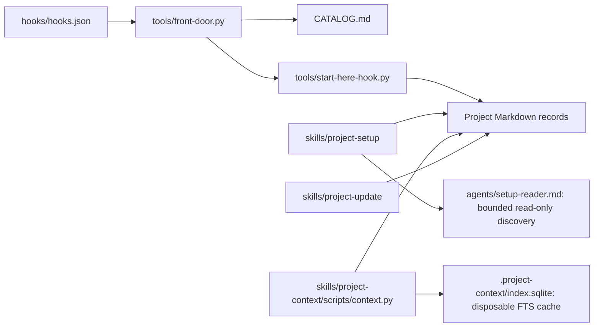

<!-- context-id: architecture:plugin -->
<!-- context-type: architecture -->
<!-- context-paths: hooks/hooks.json, tools/front-door.py, tools/start-here-hook.py, skills/project-context/scripts/context.py, skills/project-setup/SKILL.md -->
# Plugin architecture

Independent skills do engineering work; shared project memory makes their results discoverable.
This is the observed implementation, not a proposed product architecture.

## Boundaries and sources
| Relationship | Source |
|---|---|
| SessionStart invokes front-door | hooks/hooks.json:4 |
| Front-door reads generated catalog | tools/front-door.py:46 |
| Front-door loads compact project summary | tools/front-door.py:57 |
| Summary reads current intent/work pointers | tools/start-here-hook.py:104 |
| Setup owns foundation preparation/economy policy | skills/project-setup/SKILL.md:13 |
| Economy worker is declarative read-only configuration | agents/setup-reader.md:1 |
| Context indexes authoritative files transactionally | skills/project-context/scripts/context.py:161 |
| Context retrieves indexed or fallback records | skills/project-context/scripts/context.py:201 |
| Update maintains only affected records | skills/project-update/SKILL.md:20 |

## Invariants and limits
- Files own facts; SQLite is a rebuildable ignored cache. RUN.json owns driven execution state.
- Worker findings are inputs; the coordinator checks sources and product evidence before claims.
- Diagram arrows to workers/records describe instructed behavior; actual agent compliance needs evals.
- Representative context-paths identify boundary changes; internal edits need no automatic redraw.
- Mermaid source inspected; renderer not run. Live setup/worker behavior remains unvalidated.
