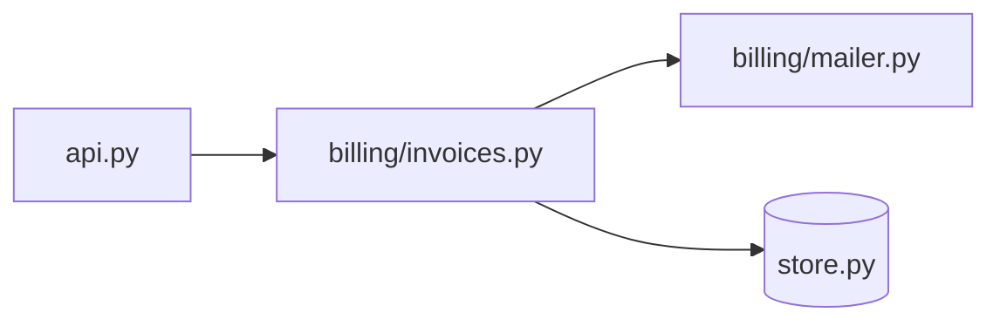

# Architecture

```mermaid
flowchart LR
  api["api.py"] --> inv["billing/invoices.py"]
  inv --> mail["billing/mailer.py"]
  inv --> store[("store.py")]
```

- `billing/invoices.py`: create, edit and send invoices.
- `billing/mailer.py`: emails a sent invoice to the customer.
- `store.py`: in-memory storage.
