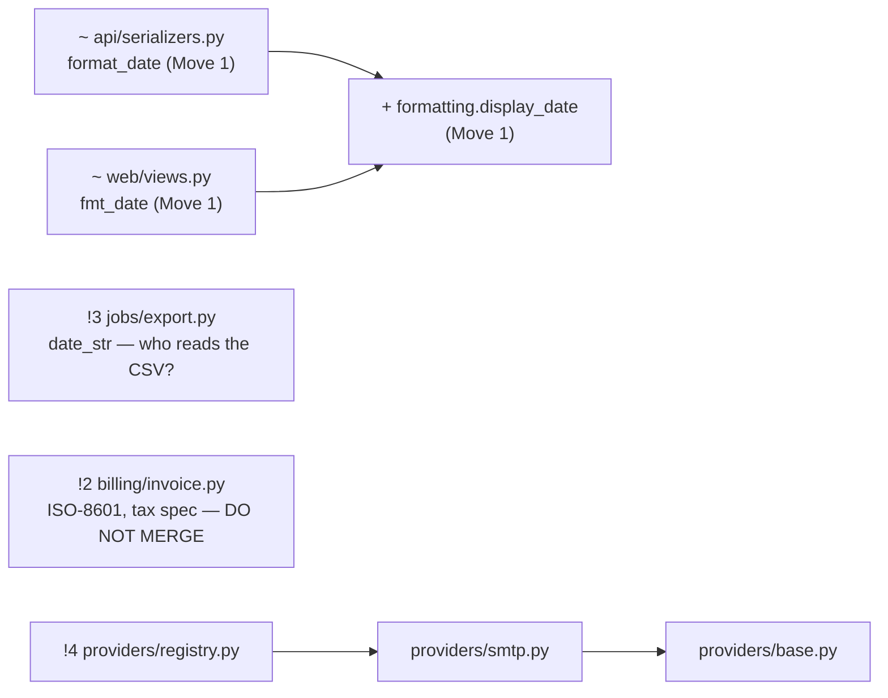

The codebase is small and mostly fine, with one real trap. Four modules turn an order date into a string. Three of them should share one helper. The fourth, `billing/invoice.py`, looks like it belongs with them and must never be merged.

## What they should know before changing anything

1. **Don't touch the billing date format.** `billing/invoice.py:5` writes dates as `YYYY-MM-DD` (ISO-8601), and the comment at lines 2–4 explains why: the tax authority's upload spec requires it, and changing it "rejects the whole filing". The code alongside it formats dates as `%d/%m/%Y`, so a find-and-replace across the date-formatting calls would quietly break tax filing. It changes when the tax spec changes, not when the display format does.

2. **The customer-facing date format is copied three times, under three names.** `api/serializers.py:2` (`format_date`), `web/views.py:2` (`fmt_date`) and `jobs/export.py:2` (`date_str`) all use `"%d/%m/%Y"`. Changing how dates are shown means finding every copy by hand. I ran them and all three print `04/03/2026`. A separate read-only agent counted the copies without being told what to expect, and got the same result.

3. **The CSV export might not be a display format.** Nothing in the repo says who reads the `jobs/export.py` output. If another system parses that CSV, its format follows that system's needs, not the UI's. Check with the team before changing it along with the other two.

4. **The `providers/` package is set up for many providers but has only one.** It has a base class, a registry and one SMTP provider, and nothing in `fixture/` calls `registry.get`. Callers may live outside this directory, so it isn't proven dead and I'm not proposing to delete it. It does already make adding a second provider (e.g. SMS) a change in one module.

## Recommended change
There's one move, small and easy to undo: create a `formatting.display_date` function and have the API and web code use it. The customer date format then lives in one file instead of two. Billing and the CSV export stay as they are. The file includes a before/after command whose output must be identical; I ran it on the current code as the baseline.

## Caveats
- **No git history.** `fixture/` isn't a git repo, so I couldn't measure which files change together, and the file's `at:` field has no commit to point to. The three likely next changes in the file are my assumptions: change the date format, add a provider, add an order field.
- **The file's self-check fails when run directly.** Without git, the checker looks for paths relative to `docs/` and reports every reference as missing. I ran it on a temporary git copy of `fixture/` instead, and it passed with 0 broken references and 0 stale ones.
- **There are no tests.** The command in the file is the only safety net for the move.

Files are in `fixture/docs/`:
- `arch-design.md`: the findings, the decision and the move
- `arch-design-map.md`: a Mermaid diagram of the change

<!-- file written by the agent: fixture/docs/arch-design-map.md -->
# fixture/ — change view

Legend: `+` added · `~` changed · `!N` finding N.

| move | what | cost | effort |
|---|---|---|---|
| 1 | one owner for customer date format (api + web) | 2 copies of "%d/%m/%Y" | S |

<!-- file written by the agent: fixture/docs/arch-design.md -->
# ARCH-DESIGN
- at: none (fixture/ is not a git repo; analysis true of the tree on 2026-09-27)
- question: what must a new engineer know before changing fixture/?
- yardstick: change the customer-facing date format (3 modules today: api, web, jobs?); add a second message provider, e.g. SMS (1 module today: providers); add a field to the order output (3 modules today: api, web, jobs)   (assumed: no tracker, requirements or history available)
- status: open
- verdict: messy in places
- context: billing/invoice.py date format stays ISO-8601 and is never routed through a shared helper; no behavior changes
- diagram: docs/arch-design-map.md

## Finding 1: Customer date format copied three times under three names
- where: api/serializers.py:2, web/views.py:2, jobs/export.py:2
- cost: 3 copies of "%d/%m/%Y" (format_date, fmt_date, date_str); changing the display format means finding all 3 by hand
- badge: strong
- evidence: proven, grep for strftime over fixture/ plus a run printing 04/03/2026 from all three; subagent recount matched

## Finding 2: billing/invoice.py looks like a 4th copy but must never be merged
- where: billing/invoice.py:1
- cost: 1 look-alike; a find-and-replace across strftime calls would break the tax filing ("rejects the whole filing", billing/invoice.py:4)
- badge: strong
- evidence: traced, the comment at billing/invoice.py:2 states the reason; same-reason test: it changes when the tax authority spec changes, not when the display format does

## Finding 3: jobs/export.py may not be a display format
- where: jobs/export.py:1
- cost: unknown; if a downstream system parses this CSV, it follows the consumer's spec, not the UI's
- badge: worth exploring
- evidence: suspected, no consumer, docs or history in the repo say who reads the export

## Finding 4: Provider base class and registry for a single SMTP provider, with no callers
- where: providers/base.py:1, providers/registry.py:6
- cost: 1 implementation, 1 registry entry, 0 call sites of registry.get inside fixture/
- badge: speculative
- evidence: suspected, grep found no callers here, but callers may live outside fixture/; not proven dead, no deletion proposed; it already makes "add SMS" a one-module change

## Decision 1: Where the shared display-date format lives
- options: new top-level formatting.py with display_date(), imported by api and web | leave three copies
- forces: yardstick "change the date format" wants one owner; billing must stay out; jobs is unresolved (Finding 3)
- door: two-way
- evidence: proven, 2 callers today (api, web) pay for a 4-line helper

## Move 1: One owner for the customer-facing date format (api + web)
- cost: 2 duplicate copies of "%d/%m/%Y" in customer-facing code (api/serializers.py:2, web/views.py:2)
- pays: change the customer date format: 2 files to find by hand → 1 (formatting.py)
- files: api/serializers.py:1, web/views.py:1
- owner: formatting.display_date, a new top-level module `formatting` (4 lines: def display_date(d): return d.strftime("%d/%m/%Y")); both callers import it and delete their local copy
- callers: api/serializers.py:6 (format_date), web/views.py:6 (fmt_date)
- door: two-way, land it and go
- proof: from fixture/, run `python3 -c "import datetime as t; from api.serializers import order_json; from web.views import order_page; from jobs.export import rows; from billing.invoice import line; o={'id':7,'placed_at':t.date(2026,3,4)}; print(order_json(o), order_page(o), rows([o]), line(o))"` and get exactly `{'id': 7, 'placed_at': '04/03/2026'} Order 7 placed 04/03/2026 ['7,04/03/2026'] 7|2026-03-04` before and after
- effort: S
- after: nothing
