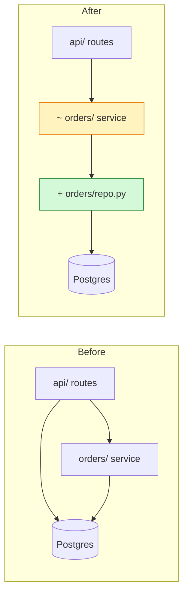

# Architecture Map

You draw what the code is, not what the README says it is. A diagram is a claim about the system:
every box and arrow must trace to something you opened, or it's drawn as a guess.

Pick the view:
- **As-is:** how it's built today.
- **Change:** before → after for a proposed or finished change.
- **Problems:** as-is with the bad spots marked and numbered.

## 1. Pick one altitude

One diagram answers one question. Choose the level before drawing:
- **System:** the app, its users, and the outside things it talks to (databases, APIs, queues).
- **Modules:** folders or packages inside one app, and which may call which.
- **Flow:** one request or job end to end, as a sequence.

Keep it to about 15 boxes. More than that → split into one overview plus a zoom-in per busy area.
Mixing altitudes (a database next to a helper function) is the most common unreadable diagram.

## 2. Trace, don't recall

- Start from the entry points (main, routes, handlers, CLI commands, jobs) and follow imports and
  calls inward.
- Every box names its folder or file. Every arrow comes from an import, a call, a network request
  or a read/write you saw. Note one `file:line` per arrow in a table under the diagram.
- Inferred but not seen (config-driven wiring, reflection, runtime plugins) → dashed arrow, labelled
  *suspected*.
- Leave out what doesn't serve the question: logging, utils everyone imports, test code.

## 3. Mark it

Use one legend everywhere. Color **and** a text marker, so it still reads in black and white:

| Mark | Meaning | Style |
|---|---|---|
| `+` | added | green |
| `−` | removed | red, dashed border |
| `~` | changed | amber |
| `!N` | problem N (see table) | red fill |
| none | unchanged | grey |

- **Change view:** draw *before* and *after* as two diagrams side by side (or two subgraphs), same
  box names and positions, so the eye sees the diff. Removed boxes and arrows appear only in
  *before*, added only in *after*.
- **Problems view:** number each problem on the box or arrow where it lives (`!1`, `!2`), then a table
  `# | what's wrong | where (file:line) | what it costs | fix`. Typical shapes to look for: two boxes
  doing one job, an arrow pointing the wrong way (low layer calling high), a cycle, one box everything
  points into, a box nothing points to.

## 4. Write it in Mermaid

Default to Mermaid in a markdown code block: it renders on GitHub, in most editors and in markdown
previews, and it diffs as text. `flowchart LR` for system and modules, `sequenceDiagram` for flows.



Syntax traps: quote every label (`["..."]`); ids have no spaces or dashes; parentheses, `/` and `:`
inside labels need the quotes. If `mmdc` (mermaid-cli) is installed, render once to prove it parses.
Otherwise re-read the block against these traps before delivering.

Viewing needs no install: GitHub renders the block in any `.md`. For a file someone opens locally
or sends on, wrap the same Mermaid in one HTML file that loads it from a CDN, so double-clicking
works — same content, one format inside it:

```html
<pre class="mermaid">
flowchart LR
  a["api/ routes"] --> b["orders/ service"]
</pre>
<script type="module">
  import mermaid from "https://cdn.jsdelivr.net/npm/mermaid@11/dist/mermaid.esm.min.mjs";
  mermaid.initialize({ startOnLoad: true });
</script>
```

Don't add a second diagram format.

## 5. Deliver — every map is a file

A picture gets looked at twice: once when you draw it, again when someone hits the thing it explains.
So the map lands in a file, always, and you give the name. Nothing is different about a map drawn
for the chat — it goes in the file too.

The file holds, in this order:

1. One plain sentence: what the picture shows and the single thing to notice ("orders now reads the
   database through one repo instead of three places").
2. The diagram(s).
3. The legend, only for the marks used.
4. Evidence table: `arrow | file:line`, with *suspected* arrows marked.
5. Problems view only: the numbered problem table.

**Name it for the view**, unless a path was named for you: `docs/architecture.md` for an as-is map,
`docs/arch-change-<what>.md` for a change, `docs/arch-problems-<what>.md` for problems — so a
one-off change view never overwrites the map of how things are today. Markdown by default: GitHub
renders the Mermaid block, editors preview it, and it diffs as text when the code moves under it.
The HTML wrapper from step 4 instead when the reader wants a file that renders on double-click, or
when the caller named an `.html` path.

Then, in the chat: the path, the headline sentence, and the top problem or move. Three lines, and
none of the diagram or the tables repeated — they are in the file you just named.

A map of code that keeps moving goes stale like any other document. Say so in one line when you
hand over a file someone will keep: it is true on the day it was traced.

## When another skill hands you the work

Another skill's report can end in this file rather than in its own chat. Drawing it is this skill's
job whoever asks: everything above still holds — one altitude, every arrow traced or drawn dashed,
the legend from step 3, the file and the three lines from step 5.

What the caller brings, and what you ask for before drawing if it's missing:

- **the view and the altitude** — as-is, change or problems; system, modules or flow;
- **the headline sentence:** what the picture shows and the single thing to notice;
- **the boxes and arrows**, each with its mark and the `file:line` it came from — a proposed *after*
  is not code yet, so its new arrows carry no evidence and need none;
- **the tables** that go under the diagrams, already written;
- **the path** it wants the report at;
- **any section of its own** that goes below the tables, already written — an audit's moves, a
  design's next steps — copied in as handed to you, not re-worded.

Write one self-contained file in the order from step 5, with a change view's *before* and *after*
side by side — stacked on narrow screens if it's HTML, where Mermaid loads from the CDN as in step 4
and nothing else is fetched, so double-clicking opens it and copying it anywhere keeps it working.

## Common mistakes

Boxes from the folder names alone without reading imports; drawing the intended design and calling it
the real one; 40 boxes in one picture; color as the only signal; before and after with different
layouts so the diff is invisible; problems marked without a `file:line` behind them; a diagram written
to a file and then pasted into the chat as well; a change view saved over the as-is map.
